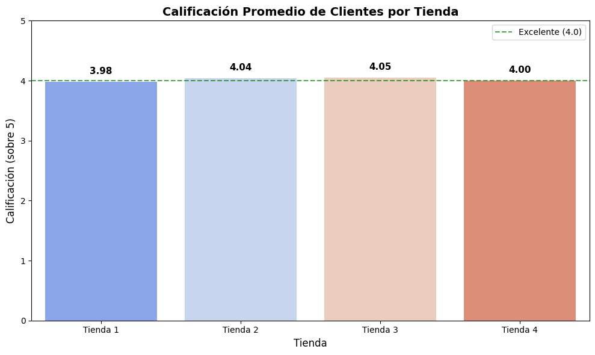
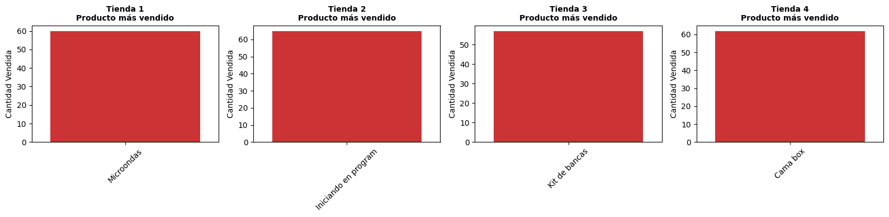
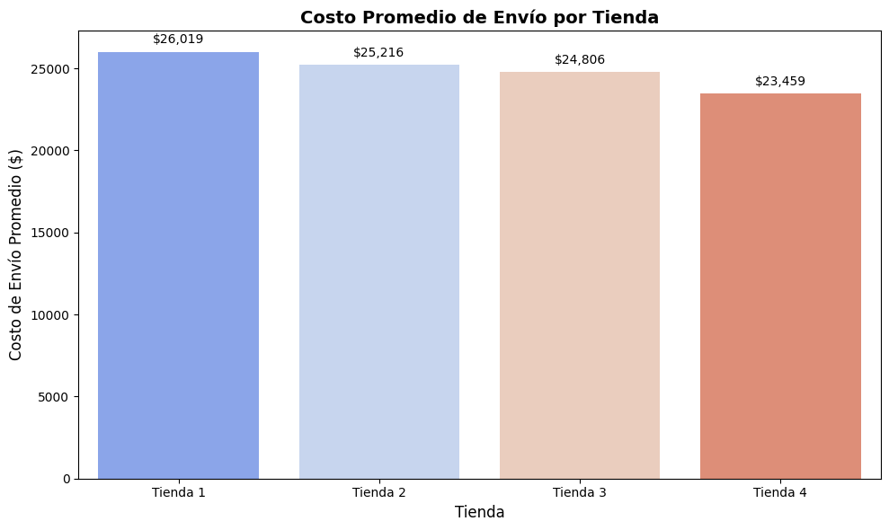

# 📊 AluraStore Latam - Análisis de Datos

## 📋 Descripción

Proyecto de análisis de datos para AluraStore Latam. Se realizó un análisis exploratorio de datos (EDA) de 4 tiendas para identificar patrones, tendencias y proporcionar recomendaciones basadas en datos que ayuden en la toma de decisiones estratégicas.

## 🎯 Objetivos

- Analizar el desempeño de ventas de 4 tiendas
- Identificar la tienda con mejor y peor rendimiento
- Determinar categorías de productos más populares
- Evaluar la satisfacción del cliente por tienda
- Analizar costos de envío
- Proporcionar recomendaciones basadas en datos

## 📊 Análisis Realizado

### 1. Facturación Total por Tienda

Análisis de los ingresos totales generados por cada tienda para identificar cuál tiene el mejor desempeño en ventas.

**Hallazgos:**
- Tienda 1 lidera en facturación total
- Tienda 4 presenta la menor facturación

### 2. Top 3 Categorías de Productos por Tienda

Identificación de las categorías de productos más vendidas en cada tienda.

**Hallazgos:**
- Electrónicos domina en la mayoría de tiendas
- Electrodomésticos y Muebles son categorías consistentes

### 3. Calificación Promedio de Clientes

Evaluación de la satisfacción del cliente mediante calificaciones promedio.

**Hallazgos:**
- Tienda 3: Mayor calificación (4.05/5.0)
- Tienda 1: Menor calificación (3.98/5.0)
- Todas las tiendas mantienen calificaciones cercanas a 4.0

### 4. Productos Más Vendidos

Análisis de los productos con mayor volumen de ventas por tienda.

**Productos destacados:**
- Tienda 1: Armario, TV LED UHD 4K, Microondas
- Tienda 2: Iniciando en programación, Microondas, Batería
- Tienda 3: Kit de bancas, Mesa de comedor, Cama king
- Tienda 4: Cama box, Cubertería, Cama king

### 5. Costo Promedio de Envío por Tienda

Comparación de los costos de envío entre las diferentes tiendas.

**Hallazgos:**
- Tienda 1: Mayor costo promedio ($26,019)
- Tienda 4: Menor costo promedio ($23,459)

## 📈 Resultados Principales

### 🏆 Tienda con Mejor Desempeño: **Tienda 1**
- Mayor facturación total: $1,150,880,400
- A pesar de tener la calificación más baja (3.98), genera más ingresos

### ⚠️ Tienda con Menor Desempeño: **Tienda 4**
- Menor facturación: $1,038,375,700
- Calificación intermedia (4.00)
- Menor costo de envío promedio

## 💡 Recomendaciones

1. **Para Tienda 4:** Considerar estrategias de marketing y promoción para aumentar ventas
2. **Para Tienda 1:** Mejorar la experiencia del cliente para aumentar la calificación
3. **Optimización de envíos:** Analizar por qué Tienda 1 tiene costos más altos
4. **Inventario:** Enfocarse en categorías de Electrónicos y Electrodomésticos
5. **Productos estrella:** Promover productos similares a los más vendidos en cada región

## 🛠️ Tecnologías Utilizadas

- **Python** - Lenguaje de programación
- **Pandas** - Manipulación y análisis de datos
- **Matplotlib/Seaborn** - Visualización de datos
- **Jupyter Notebook** - Entorno de desarrollo interactivo

## 📁 Estructura del Proyecto
AluraStoreLatam/
├── assets/ # Carpeta para imágenes
├── Copia_de_AluraStoreLatam.ipynb # Notebook con el análisis
├── README.md # Documentación del proyecto
└── Imágenes del análisis (.png)

## 📊 Métricas Clave

| Tienda   | Facturación Total | Calificación | Costo Envío Promedio |
|----------|-------------------|--------------|----------------------|
| Tienda 1 | $1,150,880,400    | 3.98/5.0     | $26,019              |
| Tienda 2 | $1,116,343,500    | 4.04/5.0     | $25,216              |
| Tienda 3 | $1,098,019,600    | 4.05/5.0     | $24,806              |
| Tienda 4 | $1,038,375,700    | 4.00/5.0     | $23,459              |

## 👤 Autor

**Jesica Sosa G**  
[Jesy284](https://github.com/Jesy284)

## 📅 Fecha

Febrero 2026

